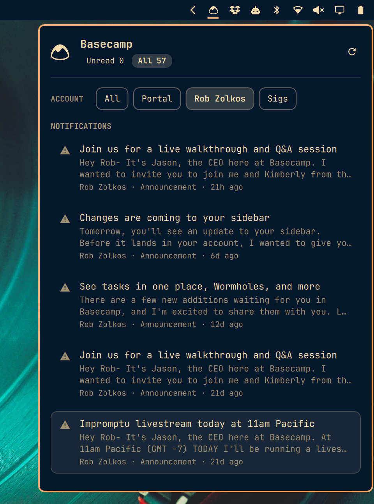

# Basecamp notifications for Omarchy

A Quickshell bar plugin that shows notifications from all Basecamp accounts available through the [Basecamp CLI](https://github.com/basecamp/basecamp-cli).



## Features

- Discovers every authorized Basecamp account automatically.
- Shows unread notifications by default.
- Combines notifications from all accounts in newest-first order.
- Filters notifications by account or between unread and all items.
- Uses notification-type icons for comments, mentions, chats, events, completions, documents, bulletins, hills, and boosts.
- Opens notifications in Basecamp and marks unread items as read.
- Changes the bar logo color when unread notifications exist.
- Polls every 10 minutes. Right-click or middle-click the bar logo to refresh immediately.

## Requirements

- Omarchy with Quickshell plugin support.
- [Basecamp CLI](https://github.com/basecamp/basecamp-cli) with the `accounts` and `notifications` commands.
- A Basecamp CLI login with full access. Read-only OAuth access cannot mark notifications as read.

Install the Basecamp CLI on Omarchy:

```bash
omarchy pkg add basecamp-cli
```

Authenticate and confirm that the CLI can see your accounts:

```bash
basecamp auth login
basecamp accounts list
basecamp notifications list
```

The plugin uses the CLI's existing credential store. It does not read, copy, or store Basecamp access tokens.

## Installation

After this repository is published on GitHub, install and enable it with:

```bash
omarchy plugin add https://github.com/basecamp/omarchy-basecamp-plugin.git --enable
```

Choose the right bar section if Omarchy asks for a placement. The plugin manifest also declares the right section as its default.

For a local checkout, pass its path instead:

```bash
omarchy plugin add ~/Work/omarchy-basecamp-plugin --enable
```

If the plugin ID is already installed, remove the existing copy first or use a separate test user. Omarchy will not overwrite an installed plugin.

## Usage

- Left-click the Basecamp logo to open or close the panel.
- Right-click or middle-click the logo to refresh.
- Select an account to filter the combined feed.
- Select `Unread` or `All` below the Basecamp title.
- Click a notification to open it. Unread notifications are also marked as read.
- Use the up and down arrow keys to move through notifications.
- Use the left and right arrow keys to move through account filters.
- Press `U` for unread notifications, `A` for all notifications, or `R` to refresh.

## Updates

Git-managed installations can be updated with:

```bash
omarchy plugin update 37signals.basecamp
```

## Removal

Remove the plugin with:

```bash
omarchy plugin remove 37signals.basecamp
```

Removing the plugin does not remove the Basecamp CLI or change its stored accounts and credentials.

## Privacy and security

The plugin runs these local CLI commands:

```text
basecamp accounts list --json
basecamp notifications list --account <account-id> --json
basecamp notifications read <notification-id> --account <account-id> --json
```

Notification data is held in the Quickshell process memory. The plugin does not write notification content, account details, credentials, or tokens to disk.

## License

MIT
